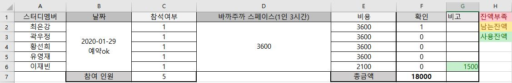

# 1월 29일까지 스스로 풀어보기
- 일정: 2020년 1월 29일 수요일 오후 7시~오후10시
- 장소: **바까주까 스페이스 (가산디지털단지역)**
- 장소 URL: https://www.youtube.com/watch?time_continue=53&v=KXK-4ICg3yQ&feature=emb_logo
- 에이스 하이엔드 타워 3차 212-1호

- 진행과정
  - 문제풀이 발표
  - 당일 같이 탐색문제 1문제(최대4문제) 같이 풀기
 

## 공간 대여료 관련 공지
- 장소: 바까주까 스페이스
- 3시간 이용금액: 18000원
- 지불 금액: 18000원 ÷ 참여인원(5) = 3600원
- 지불 방법: 카카오페이, 토스(하나은행 17491036287107 최은강)
- 팀원별 지불금액

 

## 과제 관련 공지
- 주제: 이진트리, 이진탐색트리
- 기준: **최소 3문제**
- 기간: 1월22일 ~ 1월 29일 19시 이내
- 자신이 문제를 어떻게 풀었는지 문제풀이 과정을 설명합니다.
- 원리설명 및 참고자료가 필요하다면 간단한 ppt로 작성해도 됩니다.
- **스터디 불참자도 깃허브 repository에 문제 풀었다는 것을 증명해야합니다.**

 

## 참여 관련 공지
- 1월 29일 불참 사유 의뢰: 1월 27일 자정 전까지
- **1월 27일 자정 이전까지 불참사유를 알려주시면, 벌칙이 면제됩니다.**
- **1월 29일 이후에 불참사유를 알려주시면, 벌칙이 적용됩니다.**

- 잦은 불참은(최대 5회이상) 스터디 멤버에서 제외됩니다.
- **스터디 불참: 벌금 5000원 (면제 제외)**
- **과제 미이행: 과제를 못하면 벌금은 없지만, 과제안한 상태로 스터디 참여하면 소용없습니다.**
 

## 준비물
- 이진트리, 이진탐색 트리 문제 풀이

# 이진탐색트리 기초 배우기 (선택)
- [sw아카데미 기초강의] https://swexpertacademy.com/main/learn/course/subjectDetail.do?courseId=AVuPDN86AAXw5UW6&subjectId=AWOVJ-_6qfsDFAWg&&
- [sw아카데미 기초강의] https://swexpertacademy.com/main/learn/course/subjectDetail.do?courseId=AVuPDN86AAXw5UW6&subjectId=AV185GlaI8MCFAZN
- [리트코드 BST배우기] https://leetcode.com/explore/learn/card/introduction-to-data-structure-binary-search-tree/141/basic-operations-in-a-bst/

 

# 과제 문제 (필수)
- **최소 3문제 이상 풀것**
- [ **나는 포켓몬 마스터 이다솜** - 이재빈님 ] https://www.acmicpc.net/problem/1620
- [ **방어선** - 황선희님 ] https://www.acmicpc.net/problem/3429
- [ **이진검색트리**  - 곽우정님 ] https://www.acmicpc.net/problem/5639
- [ **(리트코드-이진탐색트리)** 1038 - 최은강] https://leetcode.com/problems/binary-search-tree-to-greater-sum-tree/
- [ **(리트코드-이진트리)** 973 - 최은강] https://leetcode.com/problems/k-closest-points-to-origin/

 
