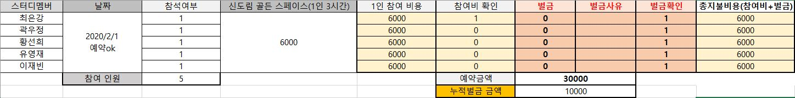

# 참여 관련 공지
- 2월 1일 불참 사유 의뢰: **1월 30일 자정 전까지**
- **1월 30일 자정 이전까지 불참사유를 알려주시면, 벌칙이 면제 및 스터디 가격 조정**
- 1월 30일 자정 이후 불참: 공간대여료(1/N) 가격 + 벌칙금 5000원

- **스터디 불참: 벌금 5000원 (면제 제외)**
- **과제 미이행: 과제를 못하면 벌금은 없지만, 과제안한 상태로 스터디 참여하면 소용없습니다.**

 

# 2월 1일까지 스스로 풀어보기
- 일정: 2020년 2월 1일 토요일 오전 11시~오후 2시 (3시간)
- 장소: **골든 스페이스 스터디룸 (신도림역 5번출구)**
- 장소 URL: https://v4.map.naver.com/local/siteview.nhn?code=1936405452&_ts=1580285076615

- 진행과정
  - 문제풀이 발표
  - 당일 같이 탐색문제 1문제(최대4문제) 같이 풀기
 

## 공간 대여료 관련 공지
- 장소: 신도림역 5번출구 골든 스페이스 스터디룸
- 3시간 이용금액: 30000원
- 지불 금액: 6000원
- 지불 방법: (3333135259310 카카오뱅크)
- 팀원별 지불금액

 

## 과제 관련 공지
- 주제: DP(Dynamic Programming)
- 기준: **최소 3문제**
- 기간: 1월29일 ~ 2월 1일 오전 11시 이내
- 자신이 문제를 어떻게 풀었는지 문제풀이 과정을 설명합니다.
- 원리설명 및 참고자료가 필요하다면 간단한 ppt로 작성해도 됩니다.
- **스터디 불참자도 깃허브 repository에 문제 풀었다는 것을 증명해야합니다.**

 

## 준비물
- DP 문제 풀이

 

# 과제 문제 (필수)
- **최소 3문제 이상 풀것**

[백준]
- https://www.acmicpc.net/problem/11726 
- https://www.acmicpc.net/problem/11057
- https://www.acmicpc.net/problem/11053
- https://www.acmicpc.net/problem/1890 (난이도 상)

[프로그래머스]
- https://programmers.co.kr/learn/courses/30/lessons/42895 
- https://programmers.co.kr/learn/courses/30/lessons/42896 (난이도 상)
 
