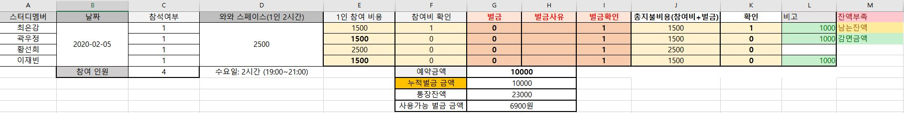

# 참여 관련 공지
- 2월 5일 불참 사유 의뢰: **2월 3일 자정 전까지**
- **2월 3일 자정 이전까지 불참사유를 알려주시면, 벌칙이 면제 및 스터디 가격 조정**
- 2월 3일 자정 이후 불참: 공간대여료(1/N) 가격 + 벌칙금 5000원

- **스터디 불참: 벌금 5000원 (면제 제외)**
- **과제 미이행: 과제를 못하면 벌금은 없지만, 과제안한 상태로 스터디 참여하면 소용없습니다.**

 

# 2월 5일 수요일까지 스스로 풀어보기
- 일정: 2020년 2월 5일 수요일 오후 7시~오후 9시 (2시간)
- 장소: **와와 스터디룸 (신림)**
- 장소 URL: 

- 진행과정
  - 문제풀이 발표
  - greedy 문제 풀기
 

## 공간 대여료 관련 공지
- 지불 방법: (3333135259310 카카오뱅크)
- 팀원별 지불금액

 

## 과제 관련 공지
- 주제: Greedy
- 기준: **최소 3문제**
- 기간: 2월1일 ~ 2월 5일 오후 7시 이내
- 자신이 문제를 어떻게 풀었는지 문제풀이 과정을 설명합니다.
- 원리설명 및 참고자료가 필요하다면 간단한 ppt로 작성해도 됩니다.
- **스터디 불참자도 깃허브 repository에 문제 풀었다는 것을 증명해야합니다.**

 

## 준비물
- greedy 문제 풀이

 

# 과제 문제 (필수)
- **최소 3문제 이상 풀것**

[백준]
-
-
-

[리트코드]
- https://leetcode.com/problems/split-a-string-in-balanced-strings/
- https://leetcode.com/problems/delete-columns-to-make-sorted/
- https://leetcode.com/problems/play-with-chips/
- https://leetcode.com/problems/last-stone-weight/
- https://leetcode.com/problems/two-city-scheduling/
- https://leetcode.com/problems/best-time-to-buy-and-sell-stock-ii/
- https://leetcode.com/problems/maximize-sum-of-array-after-k-negations/
- https://leetcode.com/problems/assign-cookies/

 
